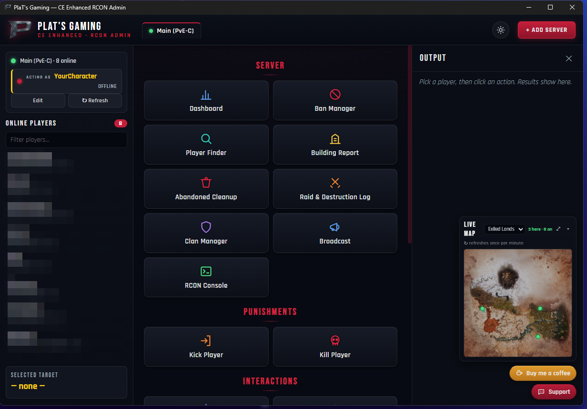
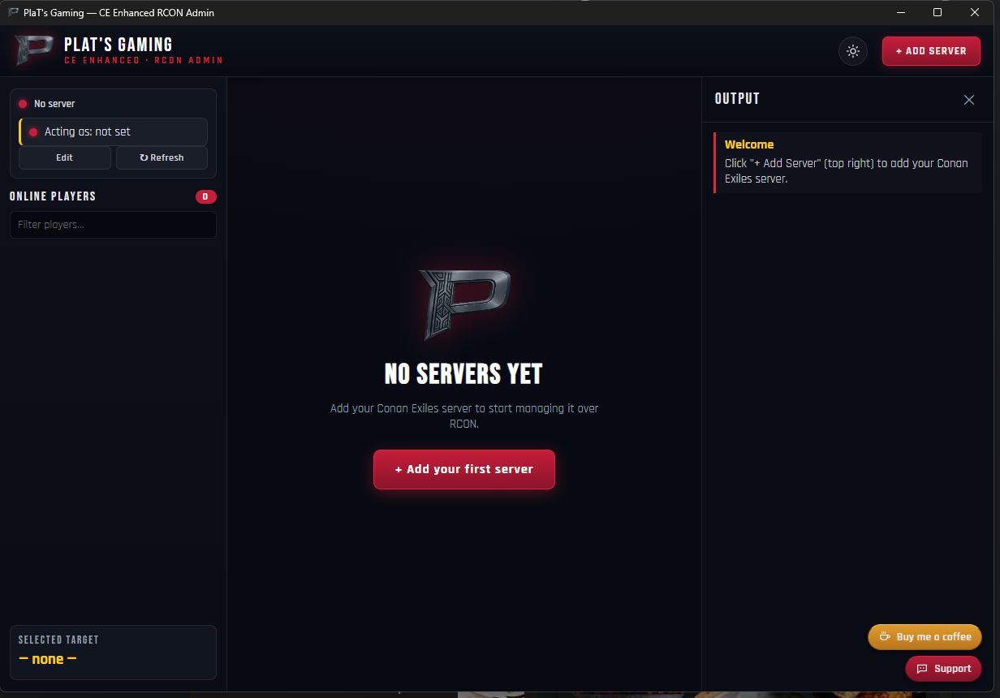

# PlaT's Gaming — CE Enhanced RCON Admin

[](https://discord.gg/TTDew4G7eR)

A desktop admin console for **Conan Exiles** servers, driven entirely over **RCON** —
**no server mods required**. Manage players, clans, buildings, bans and more from a
clean panel that talks to your server the same way any RCON tool does.

> Built for the Conan Exiles community. Bring your own server — plug in your IP,
> RCON password, and in-game character name, and go.

---

## Screenshots

**The admin panel** — every tool one click away, with the **live player map** (bottom-right). *(Server label is a demo; online-player names blurred for privacy.)*



**First run** — add your server (IP, RCON password, character name) and go:



## Features

- **Server tabs** — manage multiple servers, switch between them, light/dark theme.
- **Punishments** — Kick, Kill.
- **Interactions** — Teleport to player, Summon player, Send home.
- **Tools** — Edit / Delete character, Remove buildings,
  **View inventory (with item icons)**, **building heatmap on the in-game map**.
- **Live player map** — resize between **Normal** and **Large** (kept within the output
  column so it never covers your action buttons), or **pop it out** into its own
  resizable window. Updates when **you** click **↻**, not on a background timer.
- **Compact action grid** — every action tile fits on screen at once, no scrolling.
- **Server tools** — **Ban/Whitelist manager**, **Player finder**
  (offline players too), **Building / land-claim report**, **Raid & destruction log**,
  **Clan manager**.

Everything runs through the server's closed RCON command set (`sql`, `con`, and the
native commands) — see [`RCON_Commands.md`](RCON_Commands.md).

## Download

Three ways to get it:

1. **[platsgaming.com](https://platsgaming.com)** — download the latest installer directly.
2. **[GitHub Releases](../../releases)** — grab the **installer** (`...Setup.exe`) or the **portable zip**.
3. **Build it yourself** — see [Build from source](#build-from-source) below.

**Installing:**

- **Installer** (`...Setup.exe`) — recommended; installs everything together and makes
  a Start-menu / desktop shortcut.
- **Portable zip** — **extract the whole folder first**, then run `PlaT RCON Admin.exe`
  from inside it (the exe needs the files next to it — don't run it from inside the zip).

First launch: click **+ Add Server**, enter your server IP, RCON port, RCON password
(from `Game.ini` → `[RconPlugin] RconPassword`), and your in-game character name.

## Privacy & network — what it does and doesn't do

This app handles your RCON password, so here's exactly what it touches:

- **Connects to:** the Conan Exiles server **you** enter (its RCON IP/port).
- **Checks for updates:** GitHub Releases (and `platsgaming.com`) for a newer version. Nothing else.
- **Item icons are bundled** in the app — View Inventory works fully offline, no
  per-item fetch.
- **Stores:** your server settings — **including the RCON password** — **locally** on
  your machine (Windows `%APPDATA%`), never in this repo and never uploaded anywhere.
- **No telemetry, no analytics, no phone-home.** Read the source to verify.

## Build from source

```bash
cd app
npm install
npm start              # run in dev
npm run dist           # package a portable Windows app folder (no admin needed)
npm run dist:installer # build the NSIS installer (needs Windows Developer Mode for signing tools)
```

## Repo layout

- `app/` — the Electron app (main/preload/renderer + bundled assets).
- `extractor/` — optional .NET tool (UAssetAPI) that reads the game's `ItemTable`
  from a local Conan DevKit install to extend the bundled item-name database.
- `RCON_Commands.md` — reference of the Conan RCON command set.

## Support & community

Questions, bug reports, or feature ideas? **[Join the PlaT's Gaming Discord](https://discord.gg/TTDew4G7eR)** for help, or open an [issue](../../issues).

## License

[MIT](LICENSE) © 2026 PlaT's Gaming
